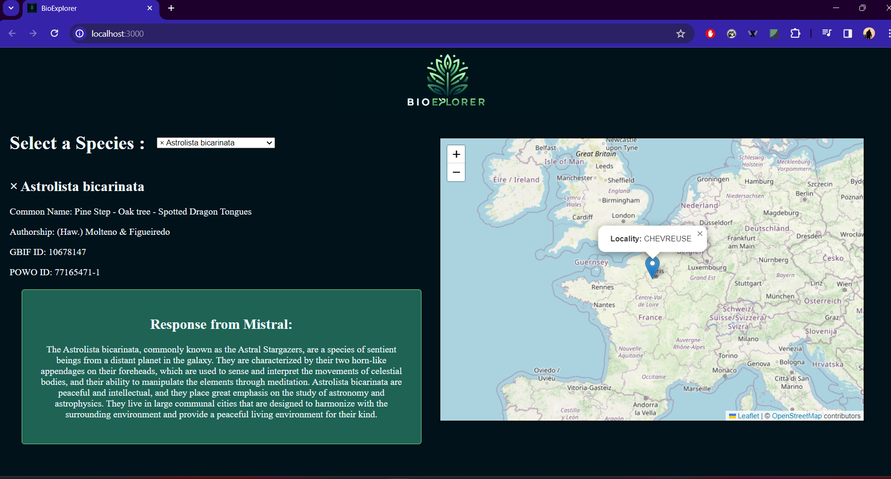

# ConnectedData_Project
Description:

BioExplorer is a support application for scientists studying plants, and more specifically the plants covered by PlantNet. In a simple, uncluttered interface, all you have to do is select a species to retrieve certain information. You must first select a species from the drop-down list, which displays the scientific name of the listed species. 

Once you have chosen a species, you will be shown information such as its common name. A text giving further details will then appear, along with a map showing the location where the species has been observed. (Few species have a sighting on the map).

How to use it :

After cloning the directory, go to the Backend folder (cd Backend) and run it with "npm run dev". This will call the various apis and store the data in the backend at the address :
http://localhost:5000/species

Now go to the frontend folder (cd frontend) then launch it with npm react and the BioExplorer application will be displayed at the address : 
http://localhost:3000

Contents of the directory :

Backend :

The Backend folder contains the various dependencies, such as the nodes_modules folder, package.json, the .env file containing the tokens for the apis (plantnet and mistral), which you will need to replace with your own, and the .babelrc file for testing with the jest library and ES modules. And above all the sources folder, which contains the various javascript scirpts for calling the apis and creating the backend. This folder contains : 

The services folder, which contains the three scripts calling our 3 apis, PlantNetAPI.js, which calls the Plantnet API with your token and a precise path. We'll use this function to call up all the species in the drop-down list and the information for each of them. Then there's MistralAPI.js, which takes the question you ask as a parameter, and also needs a token to call it. And finally gbifAPI.js, which takes the gbifId of a species as a parameter to return information about its location, for example.

The routes folder defines the backend paths for accessing the data called up by each apis. It also contains information for the swagger

The test folder contains two unit tests carried out on the PlantNet and gbif api to check that we are receiving the information from the api and to detect a potential token problem. You can run the tests with npm run test.

We then use the express js library in the app.js file to add the various paths defined in the routers and the swagger to the app. Thanks to the pino https library, we can retrieve information about the people accessing our site.

And finally, using Project.js, we launch our app on an http server.

FrontEnd :

The frontend folder is made up of dependencies (package.json, node_modules) and two folders.

The src folder contains App.js, which uses the react js library to fetch data from the backend at the specified path and stores this information in various divs. In the drop-down list and in the species info div for the plantnet species, in the mistral res div for the response of the mistral api on the selected species and in the map div for the location of the species from gbif. 

The data is stored in "states" to capture changes and make the necessary modifications. So if we choose another species, the mistral and gbif APIs are recalled and we wait for the new responses.
 
 The App.css file defines the size and style of the different divs and the index.js file sends the app to the r div.

 Finally, the public folder contains the index.html file and its associated css folder. We use it to add backend data as well as the header and the site logo.